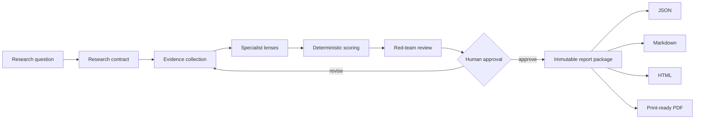
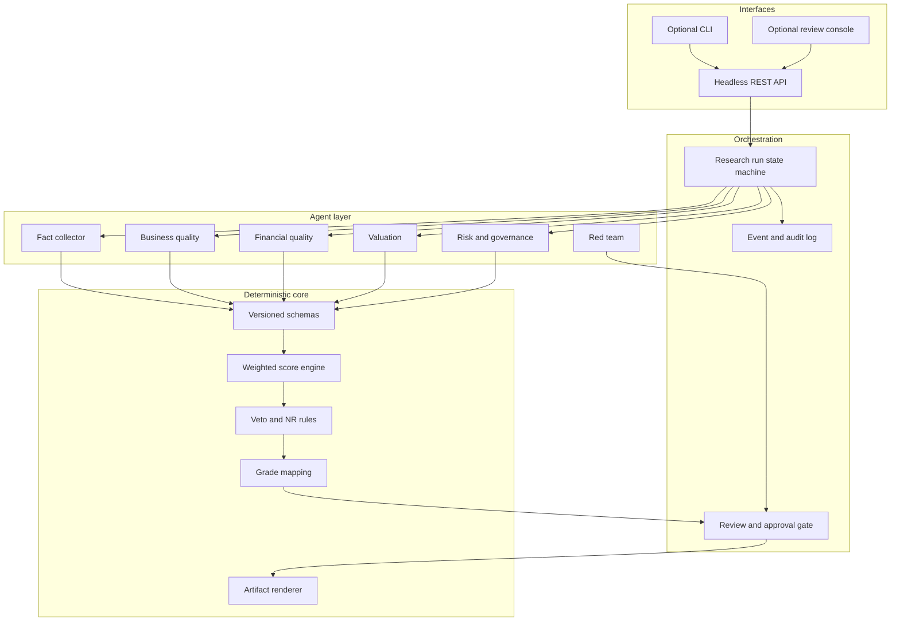

<p align="center">
  
</p>

<h1 align="center">Fathomark · 渊衡</h1>

<p align="center">
  <strong>深研有据，权衡有度。</strong><br />
  Evidence-first multi-agent equity research for people who want to see the reasoning.
</p>

<p align="center">
  <a href="docs/design/2026-09-18-fathomark-design.md"></a>
  
  
</p>

<p align="center">
  Fathomark turns a stock research question into a traceable chain of evidence,<br />
  specialist judgments, deterministic scoring, red-team review and a human-approved report.
</p>

<br />

> [!IMPORTANT]
> M1 is done: the deterministic scoring core in `packages/core` implements the `common-stock@1.0.0` framework with tests and an offline golden fixture. The API, agents and report renderers are still ahead — see [TODO.md](TODO.md).

## The idea in one sentence

**Let language models investigate the evidence, let deterministic code calculate the score, and let a human decide when a result becomes official.**

That boundary is the heart of 渊衡. Agents can read, compare, explain and challenge. They cannot silently change weights, fill missing data with a story, or publish an unreviewed rating.

## What makes it different

<table>
  <tr>
    <td width="33%" valign="top"><strong>01 · Evidence ledger</strong><br /><sub>Every factor conclusion points to dated sources, excerpts, provenance and a confidence level.</sub></td>
    <td width="33%" valign="top"><strong>02 · Deterministic core</strong><br /><sub>The same structured inputs always produce the same score, Veto result, grade and version hash.</sub></td>
    <td width="33%" valign="top"><strong>03 · Human gate</strong><br /><sub>Draft findings stay drafts until a reviewer approves an immutable release.</sub></td>
  </tr>
</table>

## From question to report



The system is intentionally a pipeline with explicit handoffs. A failed provider, weak source or unresolved contradiction becomes visible state, rather than disappearing into a final paragraph.

## Architecture at a glance



## What v1 covers

| Area | v1 decision |
| --- | --- |
| Research unit | One ordinary US-listed operating company per run |
| Product surface | Headless REST API first; CLI and Vue review console are optional clients |
| Scoring | 11-factor, 100-point framework with confidence, Veto, `NR` and versioning |
| Evidence | SEC EDGAR/XBRL, company investor relations and replaceable market-data providers |
| Models | OpenAI, Anthropic and OpenAI-compatible adapters |
| Storage | SQLite for local work; PostgreSQL for a service deployment |
| Reports | JSON, polished HTML, well-formed Markdown and print-generated PDF |
| Approval | Human approval is required before an official rating is published |

Out of scope for v1: ETFs, banks and insurers, cyclical resources, REITs, batch ranking, portfolio optimization, automated trading, multi-tenant SaaS and official A/H-share data connectors.

## A report should answer four questions

<p align="center">
  
</p>

| Reader need | Fathomark report section |
| --- | --- |
| What is the current view? | Thesis, grade, score and confidence |
| Why did it get that view? | Factor cards with evidence and counter-evidence |
| What could invalidate it? | Vetoes, open questions, risks and red-team objections |
| Can I audit the result later? | Sources, dates, framework version, input hash and approval record |

The HTML report is the visual master. Markdown remains portable, JSON remains machine-readable, and PDF is generated from the same print layout so the four formats do not drift apart.

## Designed as a backend other systems can call

The core workflow is API-first. A future client can create a run, poll its state, inspect evidence, request review, approve a version and fetch report artifacts without knowing how the web console is built.

```http
POST /v1/research-runs
Content-Type: application/json

{
  "symbol": "AAPL",
  "exchange": "NASDAQ",
  "research_role": "core",
  "as_of": "2026-09-18",
  "framework_version": "common-stock.v1"
}
```

```text
202 Accepted
Location: /v1/research-runs/run_01J...
```

The public API will expose stable contracts for `draft`, `needs_review`, `approved`, `failed` and `cancelled` states. A consumer can safely treat an approved result as a versioned research artifact rather than as a live trading instruction.

## Repository map

```text
fathomark/
├── packages/
│   ├── core/          # schemas, framework rules, scoring, Veto and grade mapping
│   ├── agents/        # specialist contracts and orchestration
│   ├── providers/     # filings, IR and market-data adapters
│   ├── reports/       # JSON, HTML, Markdown and PDF renderers
│   └── api/           # REST service and background worker entry points
├── frameworks/        # versioned scoring definitions
├── docs/              # design notes and integration guidance
├── examples/          # recorded provider responses and sample reports
└── tests/             # contract, deterministic-core and integration tests
```

## Read next

1. [System design](docs/design/2026-09-18-fathomark-design.md) — architecture, data contracts, scoring governance and report formats.
2. [Roadmap](TODO.md) — milestones, acceptance criteria and the remaining project work.

The next vertical slice (M2) adds storage, the run state machine and a headless API: create a run, submit evidence-backed proposals, review and approve an immutable version.

## Get the repository

```bash
git clone git@github.com:MapleQiAN/Fathomark.git
cd Fathomark
```

## Principles

1. Agents collect evidence, make explicit judgments and surface counterexamples; deterministic code owns arithmetic and state transitions.
2. Identical structured inputs produce identical scores, Veto results and grades.
3. Missing evidence produces `NR`; prose cannot manufacture a number.
4. Every factor conclusion is traceable to dated, source-linked evidence.
5. An approved version is immutable; a change creates a new version.
6. Fathomark is research and decision support, not a return forecast or trading instruction.

## Project status

| Milestone | State |
| --- | --- |
| Brand, architecture and contracts | ✅ Defined |
| Deterministic scoring core | ✅ Implemented (M1) |
| Agent adapters and provider recordings | ◻ Planned |
| API and worker | ◻ Planned |
| HTML / Markdown / PDF renderer | ◻ Planned |
| PersonalInvestment adapter | ◻ Planned |

M1 scoring core 已实现：`packages/core` 承载 `common-stock@1.0.0` 框架的确定性评分、Veto 与评级映射。
离线可复现：`examples/fixtures/adbe_2026-09-03` 金样测试证明同一 JSON 输入永远得到同一快照（ADBE 核心 85.75 / A+）。

## Contributing

The project is pre-1.0 and the API surface is not stable yet. Feedback is most useful when it is concrete: point to a contract, state transition, evidence rule or report section and describe the failure mode it prevents.

Planned community files include `LICENSE` (Apache-2.0), `NOTICE`, `CONTRIBUTING.md`, `CODE_OF_CONDUCT.md`, `SECURITY.md` and `DISCLAIMER.md`.

<p align="center">
  <sub>Fathomark · 渊衡</sub><br />
  <em>Deep research, measured judgment.</em>
</p>
