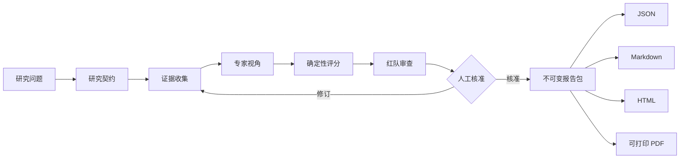
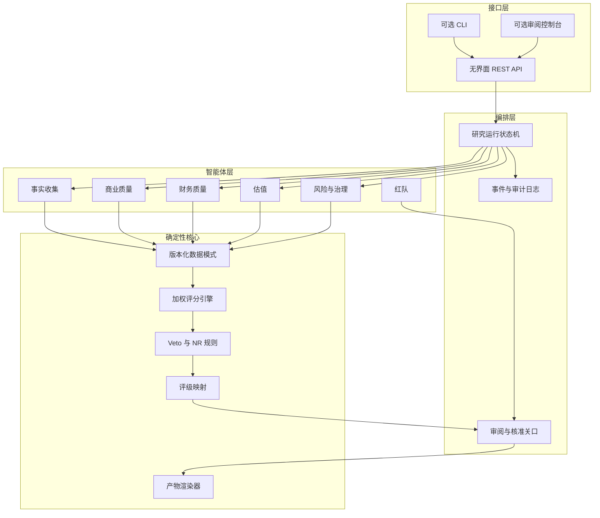

<p align="center">
  
</p>

<h1 align="center">Fathomark · 渊衡</h1>

<p align="center"><a href="README.md">English</a></p>

<p align="center">
  <strong>深研有据，权衡有度。</strong><br />
  面向希望看见推理过程的人：以证据为先的多智能体股票研究。
</p>

<p align="center">
  <a href="docs/design/2026-09-18-fathomark-design.md"></a>
  
  
</p>

<p align="center">
  Fathomark 将一个股票研究问题转化为可追溯的证据链、<br />
  专家判断、确定性评分、红队审查与经人工核准的报告。
</p>

<br />

> [!IMPORTANT]
> M1 与 M2 已完成，M3 现已由 6 个专业智能体覆盖框架全部 11 个因子：`packages/core` 中的确定性评分核心实现了 `common-stock@1.0.0` 框架；`packages/storage` 与 `packages/api` 补齐了运行状态机、存储、无界面 API、Python SDK、OpenAPI 契约与 HMAC Webhook；M3 流水线新增 LLM/证据 Provider 协议、Scope 智能体、可恢复的步骤编排器，以及从创建到草稿快照的离线 ADBE 端到端运行——参见 [TODO.md](TODO.md)。

## 一句话说明

**让语言模型调查证据，让确定性代码计算分数，让人决定何时将结果作为正式版本。**

这条边界是渊衡的核心。智能体可以阅读、比较、解释和质疑；它们不能悄然修改权重、用叙事填补缺失数据，或发布未经审阅的评级。

## 有何不同

<table>
  <tr>
    <td width="33%" valign="top"><strong>01 · 证据账本</strong><br /><sub>每一项因子结论都指向带日期的来源、摘录、来源链路和置信度。</sub></td>
    <td width="33%" valign="top"><strong>02 · 确定性核心</strong><br /><sub>同一组结构化输入必然得到同一分数、Veto 结果、等级和版本哈希。</sub></td>
    <td width="33%" valign="top"><strong>03 · 人工关口</strong><br /><sub>研究发现停留在草稿状态，直到审阅者核准不可变的正式版本。</sub></td>
  </tr>
</table>

## 一只股票如何获得它的评级

<p align="center">
  
</p>

> [!NOTE]
> 这里展示的是已通过检查、离线运行的 [`adbe_2026-09-03`](examples/fixtures/adbe_2026-09-03) 可复现夹具；它不是当前评级、预测、推荐或交易指令。

1. **确定边界。** 每次运行固定一只普通上市经营公司、一个截止日期，以及版本化的 [`common-stock@1.0.0`](frameworks/common-stock.yaml) 框架。
2. **让每个因子落在证据上。** 带日期、可回溯来源的证据和反证，共同支撑 11 个因子中每一个 0–10 的提议分数。缺口会被声明，不能靠文字抹平。
3. **先计算，再加约束。** `core`、`offensive` 与 `tactical` 研究视角使用同一组结构化提议，但针对不同研究问题重新加权。确定性代码将选定视角合成为 100 分总分和等级；触发 Veto 时结果为 `X`，置信度不足时为 `NR`，而非给出总分。
4. **发布前审阅——已实现的 API 关口。** M2 已实现 `draft` → `needs_review` → `approved` 状态流转，并记录审阅者决策。M3 现已能离线运行 Scope 智能体与 6 个专业智能体，通过确定性 cassette 回放覆盖全部 11 个因子。后台 worker 与报告渲染/发布仍在后续计划中，因此该夹具是经过检查的核心快照，而非正式报告。

### 11 个因子与它们的权重

<p align="center">
  
</p>

图形展示整体取向；下表给出每一个精确数字。三种研究视角都对同一组有证据支撑的 0–10 提议分数重新加权，而不是另起一套证据标准。

| 因子 | 分类 | `core` | `offensive` | `tactical` |
| --- | --- | ---: | ---: | ---: |
| 商业模式/护城河 | 基本面 | 22% | 15% | 3% |
| 财务健康度 | 基本面 | 22% | 8% | 8% |
| 治理质量 | 基本面 | 12% | 8% | 2% |
| 政策监管风险 | 基本面 | 8% | 6% | 0% |
| 成长可持续性 | 成长与估值 | 5% | 24% | 0% |
| 估值水平 | 成长与估值 | 11% | 17% | 10% |
| 盈利质量 | 成长与估值 | 11% | 8% | 6% |
| 趋势/动量 | 市场 | 1% | 5% | 20% |
| 交易流动性 | 市场 | 2% | 3% | 16% |
| 波动率/下行风险 | 市场 | 6% | 2% | 13% |
| 催化剂时间窗 | 市场 | 0% | 4% | 22% |
| **合计** |  | **100%** | **100%** | **100%** |

`core` 优先看商业质量与财务韧性；`offensive` 将近一半权重放在成长与估值；`tactical` 聚焦时点、流动性、下行风险与催化剂。其他维度的高分无法抵消 Veto，也无法把证据不足变成数字。

[完整框架](frameworks/common-stock.yaml)仍是因子锚点、视角权重、Veto 阈值和完整评级区间的唯一事实来源。权重变更必须通过框架版本升级，而不是修改 README。

## 从问题到报告



系统有意采用带明确交接点的流水线。供应商失败、来源薄弱或矛盾未决会成为可见状态，而不会在最终段落中消失。

## 架构一览



## v1 覆盖范围

| 范围 | v1 决策 |
| --- | --- |
| 研究单位 | 每次运行只研究一只普通美国上市经营公司 |
| 产品形态 | 优先提供无界面 REST API；CLI 和 Vue 审阅控制台是可选客户端 |
| 评分 | 11 因子、100 分框架，带置信度、Veto、`NR` 与版本管理 |
| 证据 | SEC EDGAR/XBRL、公司投资者关系材料，以及可替换的市场数据供应商 |
| 模型 | OpenAI、Anthropic 及 OpenAI 兼容适配器 |
| 存储 | 本地使用 SQLite；服务部署使用 PostgreSQL |
| 报告 | JSON、精致 HTML、规范 Markdown 和打印生成的 PDF |
| 核准 | 正式评级发布前必须经过人工核准 |

v1 不包含：ETF、银行和保险公司、周期性资源行业、REIT、批量排名、组合优化、自动交易、多租户 SaaS，以及官方 A/H 股数据连接器。

## 一份报告应回答四个问题

<p align="center">
  
</p>

| 读者需要知道什么 | Fathomark 报告章节 |
| --- | --- |
| 当前观点是什么？ | 论点、等级、分数和置信度 |
| 为什么得到这个观点？ | 含证据和反证的因子卡片 |
| 什么会使它失效？ | Veto、待解问题、风险和红队异议 |
| 之后还能审计吗？ | 来源、日期、框架版本、输入哈希和核准记录 |

HTML 报告是视觉主稿；Markdown 保持可移植，JSON 保持机器可读，PDF 从同一套打印布局生成，避免四种格式彼此漂移。

## 为可被其他系统调用而设计

核心工作流采用 API-first。未来的客户端无需了解 Web 控制台如何构建，也可以创建运行、轮询状态、查看证据、请求审阅、核准版本并获取报告产物。

```http
POST /v1/research-runs
Content-Type: application/json

{
  "symbol": "AAPL",
  "exchange": "NASDAQ",
  "research_role": "core",
  "as_of": "2026-09-18",
  "framework_version": "common-stock.v1"
}
```

```text
202 Accepted
Location: /v1/research-runs/run_01J...
```

公开 API 将对 `draft`、`needs_review`、`approved`、`failed` 和 `cancelled` 状态提供稳定契约。消费者可以将已核准的结果安全地视为有版本的研究产物，而不是实时交易指令。

## 仓库结构

```text
fathomark/
├── packages/
│   ├── core/          # 数据模式、框架规则、评分、Veto 与评级映射
│   ├── agents/        # 专家智能体契约和编排
│   ├── providers/     # 文件、IR 与市场数据适配器
│   ├── reports/       # JSON、HTML、Markdown 与 PDF 渲染器
│   └── api/           # REST 服务与后台工作器入口
├── frameworks/        # 版本化评分定义
├── docs/              # 设计说明与集成指南
├── examples/          # 已记录的供应商响应与示例报告
└── tests/             # 契约、确定性核心与集成测试
```

## 继续阅读

1. [系统设计](docs/design/2026-09-18-fathomark-design.md)——架构、数据契约、评分治理和报告格式。
2. [路线图](TODO.md)——里程碑、验收标准和项目剩余工作。

M2 已完成：`packages/storage` 与 `packages/api` 实现了运行状态机、SQLite/PostgreSQL 存储、无界面 API（创建、查询、取消、重试、审阅、批准、结果）、`packages/sdk` 中的 Python SDK、版本化 OpenAPI 契约与 HMAC Webhook。M3 新增 Provider 协议及 Fake/Replay/Recording 测试替身、Scope 智能体、带修复重试的 6 个专业智能体、按截止日/新鲜度过滤的证据标准化、可审计的 LLM 用量预算，以及记录步骤的 Red-Team 审计：结构化异议会持久化，阻塞异议会阻止草稿生成。异步 worker、自动证据不足 NR 路由与报告渲染器仍在后续计划中——参见 [TODO.md](TODO.md)。

## 获取仓库

```bash
git clone git@github.com:MapleQiAN/Fathomark.git
cd Fathomark
```

## 原则

1. 智能体收集证据、给出明确判断并提出反例；确定性代码负责算术和状态流转。
2. 相同的结构化输入产生相同的分数、Veto 结果和等级。
3. 缺失证据会产生 `NR`；文字不能凭空造出数字。
4. 每一项因子结论都可追溯到带日期、带来源链接的证据。
5. 已核准版本不可变；变更会创建新版本。
6. Fathomark 是研究和决策支持工具，不是收益预测或交易指令。

## 项目状态

| 里程碑 | 状态 |
| --- | --- |
| 品牌、架构与契约 | ✅ 已定义 |
| 确定性评分核心 | ✅ 已实现（M1） |
| 智能体适配器与供应商记录 | 协议 + Scope 与全部 6 个专业智能体 ✅（M3，离线回放） |
| API 与工作器 | API ✅ 已实现（M2）；编排器 ✅（M3 切片）；后台 worker ◻ 计划中 |
| HTML / Markdown / PDF 渲染器 | ◻ 计划中 |
| 自包含 Demo 与发布打包 | ◻ 计划中 |

M1 评分核心已实现：`packages/core` 承载 `common-stock@1.0.0` 框架的确定性评分、Veto 与评级映射。
离线可复现：`examples/fixtures/adbe_2026-09-03` 金样测试证明同一 JSON 输入永远得到同一快照（ADBE 核心 85.75 / A+）。

## 参与贡献

项目仍处于 1.0 之前，API 表面尚未稳定。如果反馈足够具体，将特别有帮助：请指出某项契约、状态转换、证据规则或报告章节，并说明它防止的失败模式。

计划中的社区文件包括 `LICENSE`（Apache-2.0）、`NOTICE`、`CONTRIBUTING.md`、`CODE_OF_CONDUCT.md`、`SECURITY.md` 和 `DISCLAIMER.md`。

<p align="center">
  <sub>Fathomark · 渊衡</sub><br />
  <em>深研有据，权衡有度。</em>
</p>
