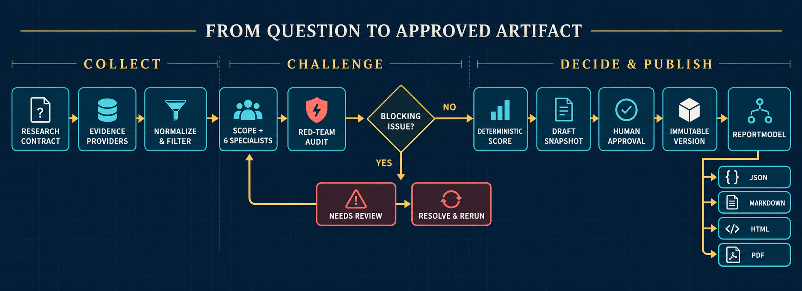
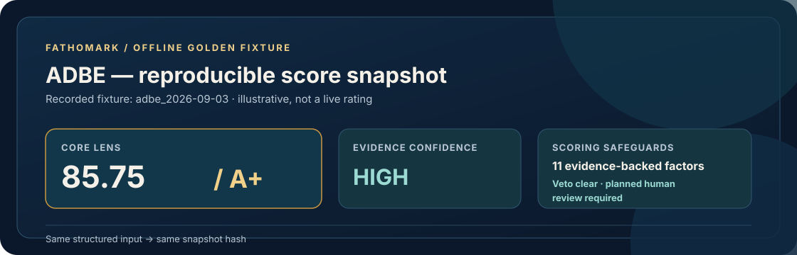
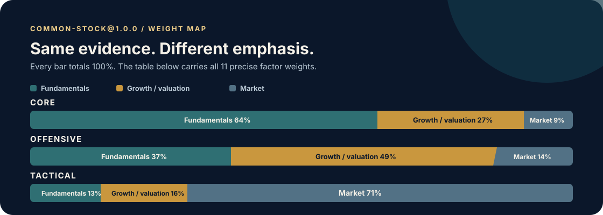
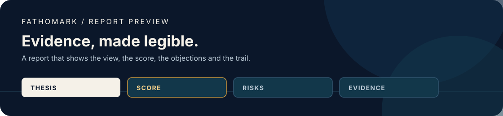

<p align="center">
  
</p>

<h1 align="center">Fathomark · 渊衡</h1>

<p align="center"><a href="README.md">English</a></p>

<p align="center">
  <strong>深研有据，权衡有度。</strong><br />
  可审计的多智能体股票研究：确定性评分，人工核准。
</p>

<p align="center">
  <a href="TODO.md"></a>
  <a href="https://github.com/MapleQiAN/Fathomark/actions/workflows/ci.yml"></a>
  
  <a href="LICENSE"></a>
</p>

<p align="center">
  Fathomark 将一个股票研究问题转化为可追溯的证据链、<br />
  专业判断、红队异议、确定性评分与经人工核准的正式版本。
</p>

> [!IMPORTANT]
> Fathomark 仍处于 1.0 之前。仓库已实现 M1–M5 核心，并通过离线夹具与 CI 校验。默认 Docker Demo 回放录制的 ADBE 案例，不会调用实时行情或模型服务。面向公网部署时，还需补充身份认证、密钥管理、Provider 授权与限流审查、监控及由运维方负责的发布检查。仓库目前还没有签名发布标签。

## 运行自包含 Demo

默认 Compose 服务使用具名卷中的 SQLite 启动 API，不要求 PostgreSQL 服务、Provider 账户或 LLM 密钥。

```bash
git clone https://github.com/MapleQiAN/Fathomark.git
cd Fathomark
docker compose up --build
```

另开一个终端：

```bash
curl http://localhost:8000/health
# {"status":"ok"}
```

接下来可按[五分钟“创建 → 执行 → 核准”教程](docs/quickstart.md)完成完整流程，也可以使用可选的 [CLI](docs/cli.md)。Demo 夹具用于可复现研究测试，不代表当前评级、预测、推荐或交易指令。

## 为什么做 Fathomark

**让语言模型调查证据，让确定性代码计算分数，让人决定何时将结果作为正式版本。**

<table>
  <tr>
    <td width="33%" valign="top"><strong>01 · 证据账本</strong><br /><sub>每项因子结论都指向带日期的来源、摘录、来源链路、反证与置信度。</sub></td>
    <td width="33%" valign="top"><strong>02 · 确定性核心</strong><br /><sub>同一组已校验输入会产生同一分数、Veto 结果、等级与内容哈希。</sub></td>
    <td width="33%" valign="top"><strong>03 · 人工关口</strong><br /><sub>红队异议始终可见，只有明确核准才能创建不可变版本。</sub></td>
  </tr>
</table>

智能体可以阅读、比较、解释和质疑；它们不能修改框架权重、为缺失证据编造数值、绕过阻断性审阅问题，或发布未经核准的评级。

## 当前已经实现

| 领域 | 仓库中的实现 |
| --- | --- |
| 确定性评分 | 版本化 `common-stock@1.0.0` 框架、11 个因子、3 种 Lens、置信度、`NR`、Veto、等级映射、反向 DCF 与敏感性计算 |
| 存储与 API | 默认 SQLite、可选 PostgreSQL、Alembic 迁移、运行状态机、幂等、乐观锁、不可变版本、制品存储、OpenAPI、SDK 与 HMAC Webhook |
| Provider 与智能体 | SEC EDGAR/XBRL、带允许列表的公司 IR 与可替换行情契约；OpenAI、Anthropic、OpenAI-compatible LLM 适配器；Scope、6 个专业智能体与 Red-Team 智能体 |
| 编排 | 记录步骤输入/输出、按截止日和新鲜度过滤、结构化输出修复、LLM 预算、明确的失败/审阅状态，以及步骤级断点恢复 |
| 报告 | 统一且经过校验的 `ReportModel`，可生成 JSON、GFM Markdown、自包含主题 HTML 与 Playwright PDF，并带 SVG 图表、内容哈希和制品 manifest |
| 本地 Demo 与发布工具 | 一条命令启动 Docker/SQLite、录制的 ADBE 黄金路径、可选 CLI、插件契约模板、锁定依赖的 CI、依赖审计与 CycloneDX SBOM |

实时适配器属于可替换的部署组件。仓库测试使用录制响应和模拟 Transport，只验证契约行为，不把它们当作实时 Provider 可用性的证明。

## 从问题到核准制品

<p align="center">
  
</p>

Provider 失败、证据过期、引用缺失和未解决异议都会成为持久化状态。编排器会在进入下一步之前提交当前步骤边界，使中断后的执行仍然可审计、可恢复。

## 一只股票如何获得评级

<p align="center">
  
</p>

> [!NOTE]
> 已通过检查的 [`adbe_2026-09-03`](examples/fixtures/adbe_2026-09-03) 是离线可复现案例，其中 85.75 / A+ 的快照属于历史测试数据。

1. **固定研究契约。** 每次运行确定一家普通上市经营公司、研究日期、数据截止日，以及版本化的 [`common-stock@1.0.0`](frameworks/common-stock.yaml) 框架。
2. **让全部 11 个因子落在证据上。** 带日期的证据与反证支撑每个因子的 0–10 提议分；缺失或过期证据保持可见。
3. **执行审计。** Red-Team 智能体记录结构化异议。只要存在阻断问题，任务就会在评分前进入 `needs_review`。
4. **确定性计算。** `core`、`offensive` 与 `tactical` Lens 对同一组提议分重新加权。触发 Veto 时返回 `X`，置信度不足时返回 `NR`。
5. **明确核准。** 审阅决定记录操作人、理由与乐观锁版本；核准后创建不可变研究版本。

### 11 个因子及其权重

<p align="center">
  
</p>

三种 Lens 使用同一套证据标准和同一组 0–10 因子提议分。

| 因子 | 分类 | `core` | `offensive` | `tactical` |
| --- | --- | ---: | ---: | ---: |
| 商业模式/护城河 | 基本面 | 22% | 15% | 3% |
| 财务健康度 | 基本面 | 22% | 8% | 8% |
| 治理质量 | 基本面 | 12% | 8% | 2% |
| 政策监管风险 | 基本面 | 8% | 6% | 0% |
| 成长可持续性 | 成长与估值 | 5% | 24% | 0% |
| 估值水平 | 成长与估值 | 11% | 17% | 10% |
| 盈利质量 | 成长与估值 | 11% | 8% | 6% |
| 趋势/动量 | 市场 | 1% | 5% | 20% |
| 流动性 | 市场 | 2% | 3% | 16% |
| 波动/下行风险 | 市场 | 6% | 2% | 13% |
| 催化窗口 | 市场 | 0% | 4% | 22% |
| **合计** |  | **100%** | **100%** | **100%** |

`core` 强调商业质量与财务韧性；`offensive` 将接近一半权重放在成长与估值；`tactical` 集中于时点、流动性、下行风险和催化事件。Veto 的优先级高于加权总分，置信度不足的结果也不能被转换成数值。

[框架 YAML](frameworks/common-stock.yaml) 是因子锚点、权重、Veto 阈值、新鲜度规则与等级边界的事实源。任何权重调整都需要发布新的框架版本。

## 报告始终绑定同一组事实

<p align="center">
  
</p>

| 读者问题 | 报告内容 |
| --- | --- |
| 当前判断是什么？ | 研究范围、等级、各 Lens 分数与置信度 |
| 哪些证据支撑它？ | 因子理由、证据与反证 |
| 什么情况会使判断失效？ | Veto、缺失数据与 Red-Team 异议 |
| 以后还能审计吗？ | 来源日期、框架引用、快照哈希、模型哈希与核准记录 |

所有渲染器都读取同一个经过完整性检查的 `ReportModel`。报告包生成 JSON、Markdown、HTML、PDF 与 manifest；API 按内容哈希和 manifest 哈希存储并提供这些制品。仓库已经在固定 Docker 字体与目标 Chromium 下检查分页、异常空白页、关键文本和横向溢出。

## API 优先的集成方式

REST API 位于 `/v1`，经过检查的契约保存在 [`docs/api/openapi-v1.json`](docs/api/openapi-v1.json)。创建任务使用幂等键：

```http
POST /v1/research-runs HTTP/1.1
Content-Type: application/json
Idempotency-Key: readme-create-1

{
  "symbol": "ADBE",
  "exchange": "NASDAQ",
  "research_role": "core",
  "horizon": "5-10y",
  "research_date": "2026-09-03",
  "data_cutoff": "2026-09-03",
  "framework_ref": "common-stock@1.0.0"
}
```

第一次请求返回 `201 Created`；使用同一个幂等键重放时返回 `200 OK`。API 已提供创建、查询、执行、导入、评分、审阅、解决审阅、核准、取消、重试、结果与制品端点。[Python SDK](docs/api-and-sdk.md) 与 [CLI](docs/cli.md) 保持为薄客户端，评分与核准规则仍由服务端执行。

## 范围与边界

| 领域 | v1 边界 |
| --- | --- |
| 研究单位 | 每次运行研究一家普通美股上市经营公司 |
| 产品形态 | Headless REST API、Python SDK 与可选 CLI；不内置审阅台 UI |
| 执行方式 | Demo 通过同步 `/execute` 执行，并保存可恢复步骤记录；不包含独立队列或 Worker 服务 |
| 存储 | 本地默认使用嵌入式 SQLite；服务化部署可选 PostgreSQL |
| Provider | 实时适配器需要部署方配置密钥、审查条款、设置限流并检查可用性 |
| 安全 | 本地 API 没有内置生产级身份认证；暴露到网络前必须遵循 [SECURITY.md](SECURITY.md) |
| 发布 | 已有 CI、SBOM 与发布检查；正式发布仍需维护者批准和签名标签 |

ETF、银行与保险、周期资源、REIT、批量排名、组合优化、自动交易、多租户 SaaS 与正式 A 股/港股接口不在 v1 范围内。

## 仓库结构

```text
Fathomark/
├── packages/
│   ├── core/          # Schema、框架加载、评分、Veto 与估值
│   ├── providers/     # 证据、行情与 LLM Provider 契约/适配器
│   ├── agents/        # Scope、专业智能体、Red-Team 与可恢复编排
│   ├── storage/       # SQLAlchemy 仓储、状态机与 Alembic 迁移
│   ├── api/           # FastAPI 服务与录制 Demo 配置
│   ├── sdk/           # 轻量 Python API 客户端
│   ├── reporting/     # ReportModel、图表、渲染器、PDF 检查与 manifest
│   └── cli/           # 可选 API 客户端与插件契约模板
├── frameworks/        # 版本化评分定义
├── examples/fixtures/ # 录制的离线研究案例
├── docs/              # 契约、指南、设计与发布证据
├── scripts/           # cassette、OpenAPI 与 PDF 校验工具
└── tests/             # 仓库级发布契约
```

## 文档

- [五分钟本地 Demo](docs/quickstart.md)
- [API 与 Python SDK](docs/api-and-sdk.md) · [OpenAPI v1](docs/api/openapi-v1.json)
- [CLI](docs/cli.md) · [插件开发](docs/plugin-development.md)
- [数据 Provider](DATA_PROVIDERS.md) · [模型 Provider](MODEL_PROVIDERS.md)
- [报告开发](docs/reporting-development.md) · [评分框架开发](docs/framework-development.md)
- [系统设计](docs/design/2026-09-18-fathomark-design.md) · [路线图](TODO.md) · [发布检查](docs/release-checklist.md)

## 本地开发

本地开发需要 Python 3.12+ 与 [uv](https://docs.astral.sh/uv/)。

```bash
uv sync --locked
uv run ruff check .
uv run ruff format --check .
uv run pytest -q
```

贡献流程见 [CONTRIBUTING.md](CONTRIBUTING.md)。项目仍处于 1.0 之前；修改契约时应同步更新对应测试和文档。

## 原则

1. 智能体收集证据、给出明确判断并提出反例；确定性代码负责算术与状态流转。
2. 相同的已校验输入会产生相同的分数、Veto 结果、等级与哈希。
3. 缺失证据会产生 `NR` 或审阅状态；文字不能凭空造出数字。
4. 每项因子结论都保持可追溯到带日期、带来源链接的证据。
5. 已核准版本不可变。
6. Fathomark 支持研究决策，不预测收益，也不生成交易指令。

项目政策见 [LICENSE](LICENSE)、[NOTICE](NOTICE)、[CODE_OF_CONDUCT.md](CODE_OF_CONDUCT.md)、[DISCLAIMER.md](DISCLAIMER.md)、[SECURITY.md](SECURITY.md)、[DATA_PROVIDERS.md](DATA_PROVIDERS.md) 与 [MODEL_PROVIDERS.md](MODEL_PROVIDERS.md)。

<p align="center">
  <sub>Fathomark · 渊衡</sub><br />
  <em>深研有据，权衡有度。</em>
</p>
